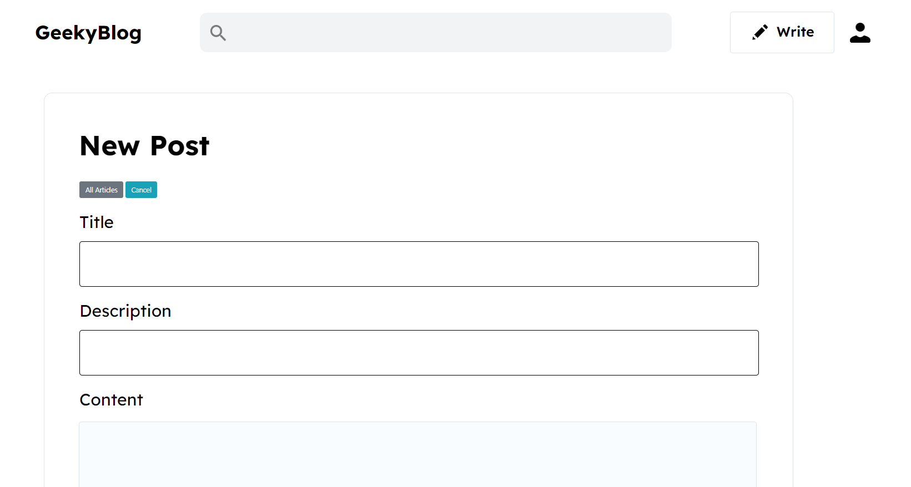

# Geeky blog

# Installation
* 1 - git clone https://github.com/Ugyenwangdi/GeekyBlog.git
* 2 - cd GeekyBlog
*  - npm install
*  - npm start

# Features
* Write/edit/delete article using markdown
* Show recent, top articles
* Like post, bookmark post
* Show my bookmarks
* Update profile

# Tech Stack
* HTML, CSS, JavaScript
* MongoDB
* Node.js
* Express

# Home Page
  

# Write post
  

# All articles
  

# Top Page
  

# Bookmarks
  

# Settings
  

